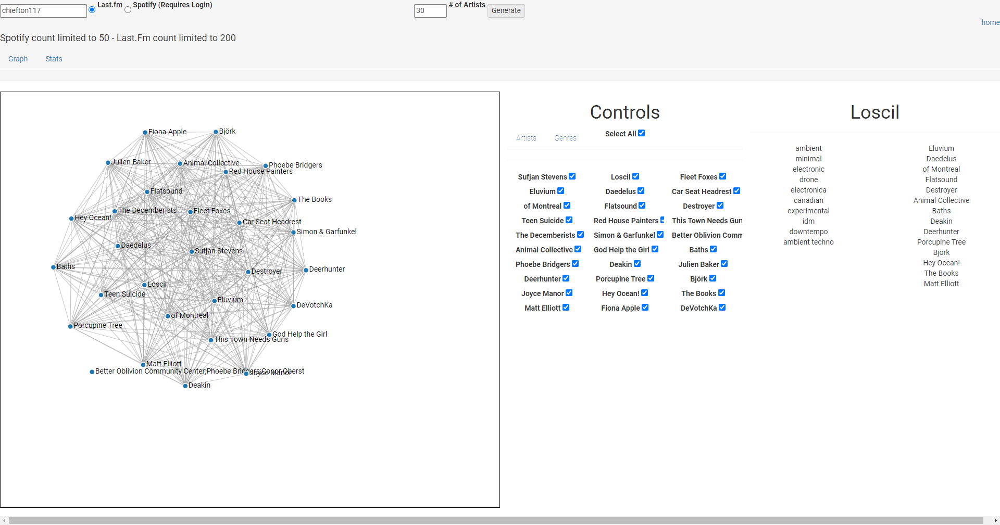
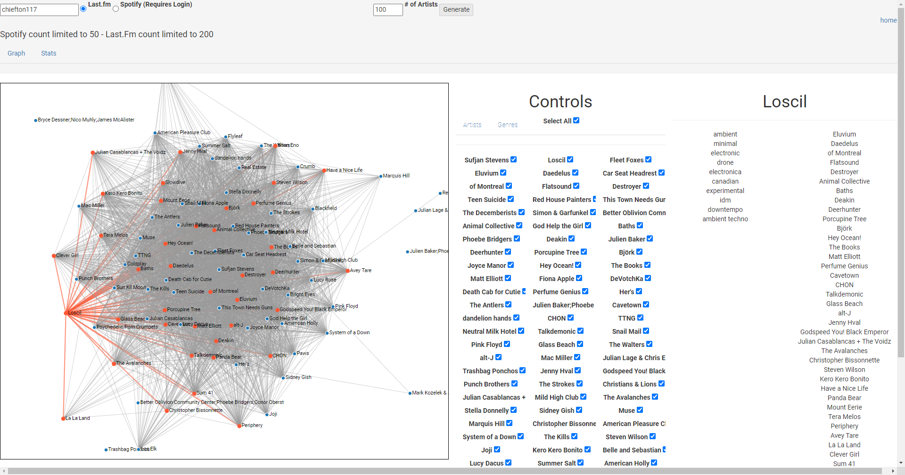

# Project Description
A d3 generated force-directed graph of any given user's artists, linked by common tags

now with spotify integration!

This project was created with the goal of visualizing the style of music you gravitate towards. By visualizing your favorite artists, you can see how consistent your taste in genres is, and what artists resonate closest with those genres.

Some limitations of this project are a lack of provided genres from Spotify artists, an abundance and over-linking of Last.FM artists, and an accuracy of genre reporting. Last.FM relies on user-reporting to classify artsits - for smaller artists, this can mis-classify an artist from one or two individual's opinions.

# Examples

# Data Schema

# Libraries

This project is powered by:

*[jQuery](https://jquery.com/)

*[D3.js](https://d3js.org/)

*[Last.fm](https://www.last.fm/api)

*[Spotify](https://developer.spotify.com/documentation/web-api/quick-start/)

*[Bootstrap](https://getbootstrap.com/)
